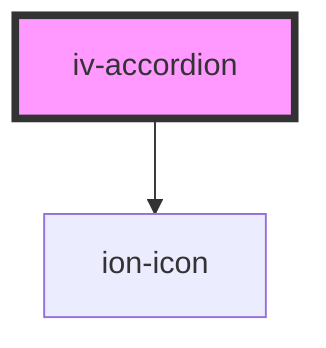

# iv-accordion

<!-- Auto Generated Below -->

## Properties

| Property           | Attribute          | Description | Type                                      | Default      |
| ------------------ | ------------------ | ----------- | ----------------------------------------- | ------------ |
| `acordionlayout`   | `acordionlayout`   |             | `"horizontal" \| "vertical"`              | `'vertical'` |
| `allowmultiple`    | `allowmultiple`    |             | `boolean`                                 | `undefined`  |
| `contentplacement` | `contentplacement` |             | `"below" \| "right"`                      | `'right'`    |
| `dropdownicon`     | `dropdownicon`     |             | `"add-outline" \| "chevron-down-outline"` | `undefined`  |
| `labels`           | `labels`           |             | `string`                                  | `undefined`  |
| `startopen`        | `startopen`        |             | `boolean`                                 | `undefined`  |

## Dependencies

### Depends on

- ion-icon

### Graph

----------------------------------------------

*Built with [StencilJS](https://stenciljs.com/)*
