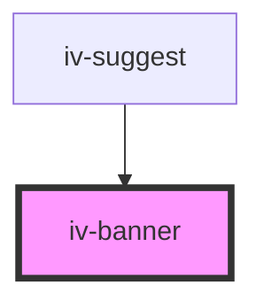

# iv-banner

<!-- Auto Generated Below -->

## Properties

| Property           | Attribute          | Description | Type                              | Default     |
| ------------------ | ------------------ | ----------- | --------------------------------- | ----------- |
| `bannerbuttontext` | `bannerbuttontext` |             | `string`                          | `undefined` |
| `bannertype`       | `bannertype`       |             | `"article" \| "div" \| "section"` | `'div'`     |
| `bannerurl`        | `bannerurl`        |             | `string`                          | `undefined` |
| `classmodifier`    | `classmodifier`    |             | `string`                          | `undefined` |

## Dependencies

### Used by

 - [iv-suggest](../iv-suggest)

### Graph

----------------------------------------------

*Built with [StencilJS](https://stenciljs.com/)*
