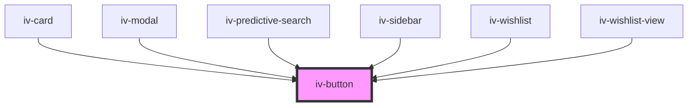

# iv-button

<!-- Auto Generated Below -->

## Properties

| Property        | Attribute       | Description | Type                       | Default     |
| --------------- | --------------- | ----------- | -------------------------- | ----------- |
| `buttonClick`   | --              |             | `(e?: MouseEvent) => void` | `undefined` |
| `classmodifier` | `classmodifier` |             | `string`                   | `undefined` |
| `eventdetail`   | `eventdetail`   |             | `string`                   | `undefined` |
| `eventname`     | `eventname`     |             | `string`                   | `undefined` |
| `type`          | `type`          |             | `string`                   | `'button'`  |

## Events

| Event    | Description | Type               |
| -------- | ----------- | ------------------ |
| `action` |             | `CustomEvent<any>` |

## Dependencies

### Used by

 - [iv-card](../iv-card)
 - [iv-modal](../iv-modal)
 - [iv-predictive-search](../iv-predictive-search)
 - [iv-sidebar](../iv-sidebar)
 - [iv-wishlist](../iv-wishlist)
 - [iv-wishlist-view](../iv-wishlist-view)

### Graph

----------------------------------------------

*Built with [StencilJS](https://stenciljs.com/)*
