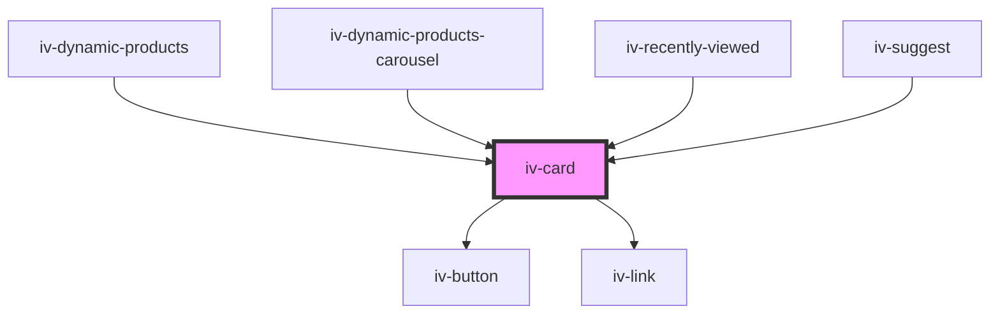

# iv-card

<!-- Auto Generated Below -->

## Properties

| Property        | Attribute       | Description | Type                    | Default     |
| --------------- | --------------- | ----------- | ----------------------- | ----------- |
| `addtocarttext` | `addtocarttext` |             | `string`                | `undefined` |
| `buttontext`    | `buttontext`    |             | `string`                | `undefined` |
| `calltoaction`  | `calltoaction`  |             | `boolean`               | `false`     |
| `cardtype`      | `cardtype`      |             | `string`                | `undefined` |
| `classmodifier` | `classmodifier` |             | `string`                | `undefined` |
| `data`          | --              |             | `{ [x: string]: any; }` | `undefined` |
| `fields`        | `fields`        |             | `string`                | `undefined` |

## Dependencies

### Used by

 - [iv-dynamic-products](../iv-dynamic-products)
 - [iv-dynamic-products-carousel](../iv-dynamic-products-carousel)
 - [iv-recently-viewed](../iv-recently-viewed)
 - [iv-suggest](../iv-suggest)

### Depends on

- [iv-button](../iv-button)
- [iv-link](../iv-link)

### Graph

----------------------------------------------

*Built with [StencilJS](https://stenciljs.com/)*
