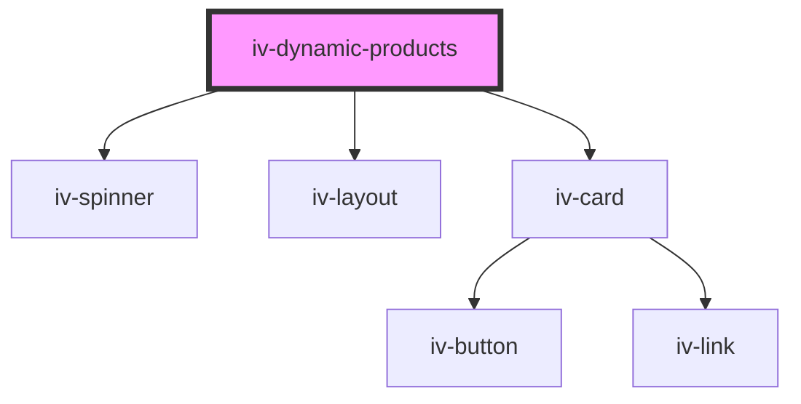

# iv-dynamic-products

<!-- Auto Generated Below -->

## Properties

| Property           | Attribute          | Description | Type                                                                               | Default               |
| ------------------ | ------------------ | ----------- | ---------------------------------------------------------------------------------- | --------------------- |
| `addtocarttext`    | `addtocarttext`    |             | `string`                                                                           | `undefined`           |
| `buttontext`       | `buttontext`       |             | `string`                                                                           | `undefined`           |
| `cachettl`         | `cachettl`         |             | `number`                                                                           | `undefined`           |
| `calltoaction`     | `calltoaction`     |             | `boolean`                                                                          | `false`               |
| `carousel`         | `carousel`         |             | `boolean`                                                                          | `false`               |
| `collectionhandle` | `collectionhandle` |             | `string`                                                                           | `'all'`               |
| `componenttitle`   | `componenttitle`   |             | `string`                                                                           | `undefined`           |
| `emptystring`      | `emptystring`      |             | `string`                                                                           | `'No products found'` |
| `gridlayout`       | `gridlayout`       |             | `string`                                                                           | `undefined`           |
| `limit`            | `limit`            |             | `number`                                                                           | `8`                   |
| `requestedfields`  | `requestedfields`  |             | `string`                                                                           | `undefined`           |
| `reversed`         | `reversed`         |             | `boolean`                                                                          | `false`               |
| `stale`            | `stale`            |             | `boolean`                                                                          | `true`                |
| `titletag`         | `titletag`         |             | `"h1" \| "h2" \| "h3" \| "h4" \| "h5" \| "h6"`                                     | `'h2'`                |
| `type`             | `type`             |             | `"BEST_SELLING" \| "CREATED" \| "CREATED_AT" \| "PRICE" \| "RELEVANCE" \| "TITLE"` | `'CREATED_AT'`        |

## Dependencies

### Depends on

- [iv-spinner](../iv-spinner)
- [iv-layout](../iv-layout)
- [iv-card](../iv-card)

### Graph

----------------------------------------------

*Built with [StencilJS](https://stenciljs.com/)*
