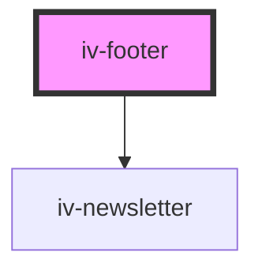

# iv-footer

<!-- Auto Generated Below -->

## Properties

| Property                   | Attribute                  | Description | Type      | Default     |
| -------------------------- | -------------------------- | ----------- | --------- | ----------- |
| `includecontacticons`      | `includecontacticons`      |             | `boolean` | `undefined` |
| `includecopyright`         | `includecopyright`         |             | `boolean` | `undefined` |
| `includenewsletter`        | `includenewsletter`        |             | `boolean` | `undefined` |
| `includesitelinks`         | `includesitelinks`         |             | `boolean` | `undefined` |
| `includesocialicons`       | `includesocialicons`       |             | `boolean` | `undefined` |
| `includesupportedpayments` | `includesupportedpayments` |             | `boolean` | `undefined` |
| `sitelinkcollapse`         | `sitelinkcollapse`         |             | `boolean` | `undefined` |

## Dependencies

### Depends on

- [iv-newsletter](../iv-newsletter)

### Graph

----------------------------------------------

*Built with [StencilJS](https://stenciljs.com/)*
