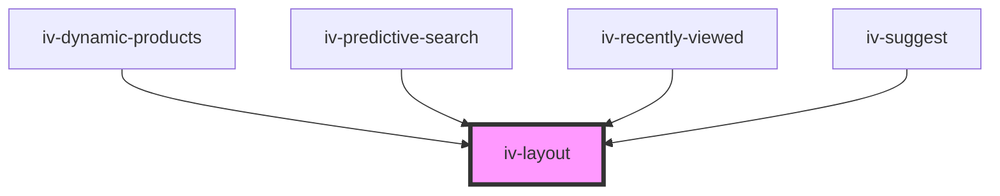

# iv-layout

<!-- Auto Generated Below -->

## Properties

| Property            | Attribute             | Description | Type     | Default     |
| ------------------- | --------------------- | ----------- | -------- | ----------- |
| `classModifier`     | `class-modifier`      |             | `string` | `undefined` |
| `gap`               | `gap`                 |             | `string` | `'2rem'`    |
| `gridTemplateAreas` | `grid-template-areas` |             | `string` | `undefined` |
| `horizontalAlign`   | `horizontal-align`    |             | `string` | `'center'`  |
| `sectionId`         | `section-id`          |             | `string` | `undefined` |
| `verticalAlign`     | `vertical-align`      |             | `string` | `'center'`  |
| `wrapperTag`        | `wrapper-tag`         |             | `string` | `'div'`     |

## Dependencies

### Used by

 - [iv-dynamic-products](../iv-dynamic-products)
 - [iv-predictive-search](../iv-predictive-search)
 - [iv-recently-viewed](../iv-recently-viewed)
 - [iv-suggest](../iv-suggest)

### Graph

----------------------------------------------

*Built with [StencilJS](https://stenciljs.com/)*
