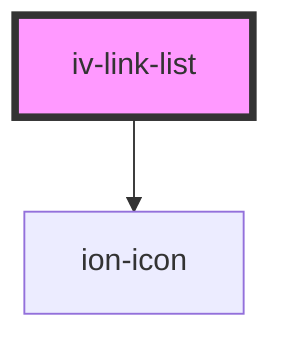

# iv-link-list

<!-- Auto Generated Below -->

## Properties

| Property    | Attribute   | Description | Type                              | Default      |
| ----------- | ----------- | ----------- | --------------------------------- | ------------ |
| `layout`    | `layout`    |             | `"horizontal" \| "vertical"`      | `'vertical'` |
| `links`     | `links`     |             | `string`                          | `undefined`  |
| `linktype`  | `linktype`  |             | `"contact" \| "social" \| "text"` | `'social'`   |
| `showicons` | `showicons` |             | `boolean`                         | `false`      |

## Dependencies

### Depends on

- ion-icon

### Graph

----------------------------------------------

*Built with [StencilJS](https://stenciljs.com/)*
