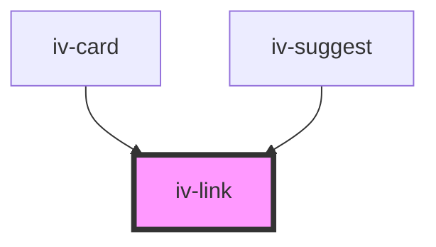

# iv-link

<!-- Auto Generated Below -->

## Properties

| Property        | Attribute        | Description | Type                                         | Default                 |
| --------------- | ---------------- | ----------- | -------------------------------------------- | ----------------------- |
| `classmodifier` | `classmodifier`  |             | `string`                                     | `undefined`             |
| `linkariaLabel` | `linkaria-label` |             | `string`                                     | `undefined`             |
| `linkhref`      | `linkhref`       |             | `string`                                     | `undefined`             |
| `linkrel`       | `linkrel`        |             | `string`                                     | `'noopener noreferrer'` |
| `linktarget`    | `linktarget`     |             | `"_blank" \| "_parent" \| "_self" \| "_top"` | `'_self'`               |
| `linktype`      | `linktype`       |             | `"button" \| "inline" \| "nav" \| "wrapper"` | `'inline'`              |

## Dependencies

### Used by

 - [iv-card](../iv-card)
 - [iv-suggest](../iv-suggest)

### Graph

----------------------------------------------

*Built with [StencilJS](https://stenciljs.com/)*
