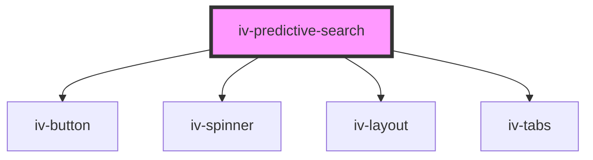

# iv-predictive-search

<!-- Auto Generated Below -->

## Properties

| Property             | Attribute            | Description | Type                | Default                             |
| -------------------- | -------------------- | ----------- | ------------------- | ----------------------------------- |
| `action`             | `action`             |             | `string`            | `undefined`                         |
| `clearbutton`        | `clearbutton`        |             | `string`            | `undefined`                         |
| `debounce`           | `debounce`           |             | `number`            | `300`                               |
| `expandable`         | `expandable`         |             | `boolean`           | `false`                             |
| `gridlayout`         | `gridlayout`         |             | `string`            | `undefined`                         |
| `labelposition`      | `labelposition`      |             | `"inline" \| "top"` | `'top'`                             |
| `method`             | `method`             |             | `"get" \| "post"`   | `'get'`                             |
| `minchars`           | `minchars`           |             | `number`            | `3`                                 |
| `noresultstext`      | `noresultstext`      |             | `string`            | `'No results found'`                |
| `placeholder`        | `placeholder`        |             | `string`            | `undefined`                         |
| `querybuttontext`    | `querybuttontext`    |             | `string`            | `undefined`                         |
| `requestedfields`    | `requestedfields`    |             | `string`            | `'title'`                           |
| `requestedresources` | `requestedresources` |             | `string`            | `'product,article,page,collection'` |
| `resultslimit`       | `resultslimit`       |             | `number`            | `5`                                 |
| `searchlabel`        | `searchlabel`        |             | `string`            | `undefined`                         |
| `showallbuttontext`  | `showallbuttontext`  |             | `string`            | `undefined`                         |
| `showspinner`        | `showspinner`        |             | `boolean`           | `undefined`                         |
| `tablayout`          | `tablayout`          |             | `string`            | `undefined`                         |

## Events

| Event                | Description | Type               |
| -------------------- | ----------- | ------------------ |
| `searchTermsChanged` |             | `CustomEvent<any>` |

## Dependencies

### Depends on

- [iv-button](../iv-button)
- [iv-spinner](../iv-spinner)
- [iv-layout](../iv-layout)
- [iv-tabs](../iv-tabs)

### Graph

----------------------------------------------

*Built with [StencilJS](https://stenciljs.com/)*
