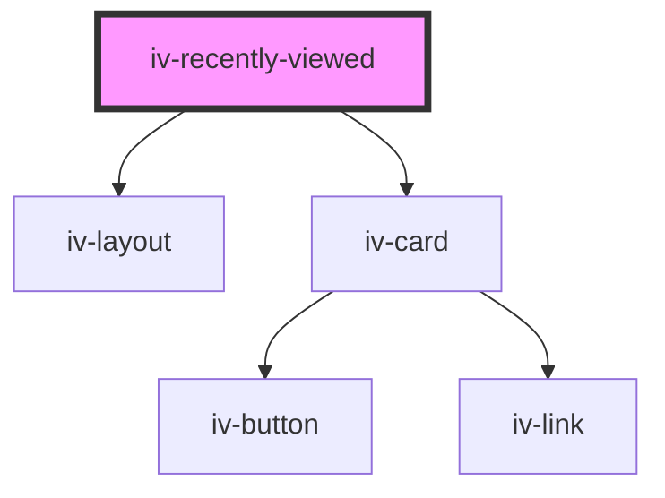

# iv-recently-viewed

<!-- Auto Generated Below -->

## Properties

| Property          | Attribute         | Description | Type                                                     | Default                |
| ----------------- | ----------------- | ----------- | -------------------------------------------------------- | ---------------------- |
| `componenttitle`  | `componenttitle`  |             | `string`                                                 | `undefined`            |
| `noviewhistory`   | `noviewhistory`   |             | `string`                                                 | `undefined`            |
| `numbertoshow`    | `numbertoshow`    |             | `number`                                                 | `4`                    |
| `requestedfields` | `requestedfields` |             | `string`                                                 | `'images,title,price'` |
| `titletag`        | `titletag`        |             | `"h1" \| "h2" \| "h3" \| "h4" \| "h5" \| "h6" \| "span"` | `'span'`               |

## Dependencies

### Depends on

- [iv-layout](../iv-layout)
- [iv-card](../iv-card)

### Graph

----------------------------------------------

*Built with [StencilJS](https://stenciljs.com/)*
