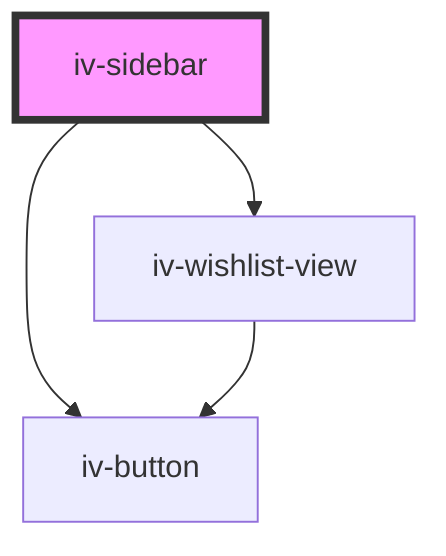

# iv-sidebar

<!-- Auto Generated Below -->

## Properties

| Property    | Attribute   | Description | Type     | Default |
| ----------- | ----------- | ----------- | -------- | ------- |
| `closeicon` | `closeicon` |             | `string` | `'×'`   |

## Dependencies

### Depends on

- [iv-button](../iv-button)
- [iv-wishlist-view](../iv-wishlist-view)

### Graph

----------------------------------------------

*Built with [StencilJS](https://stenciljs.com/)*
