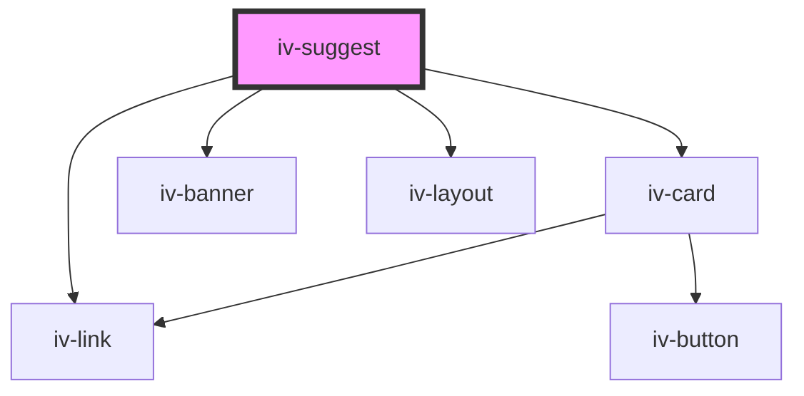

# iv-suggest

<!-- Auto Generated Below -->

## Properties

| Property           | Attribute          | Description | Type                                                     | Default     |
| ------------------ | ------------------ | ----------- | -------------------------------------------------------- | ----------- |
| `banner`           | `banner`           |             | `string`                                                 | `undefined` |
| `bannerbuttontext` | `bannerbuttontext` |             | `string`                                                 | `undefined` |
| `bannertitle`      | `bannertitle`      |             | `string`                                                 | `undefined` |
| `bannertitletag`   | `bannertitletag`   |             | `"h1" \| "h2" \| "h3" \| "h4" \| "h5" \| "h6" \| "span"` | `'span'`    |
| `bannerurl`        | `bannerurl`        |             | `string`                                                 | `undefined` |
| `collections`      | `collections`      |             | `string`                                                 | `undefined` |
| `collectionstitle` | `collectionstitle` |             | `string`                                                 | `undefined` |
| `gridlayout`       | `gridlayout`       |             | `string`                                                 | `undefined` |
| `products`         | `products`         |             | `string`                                                 | `undefined` |
| `productstitle`    | `productstitle`    |             | `string`                                                 | `undefined` |
| `requestfields`    | `requestfields`    |             | `string`                                                 | `undefined` |
| `topqueries`       | `topqueries`       |             | `string`                                                 | `undefined` |
| `topquerytitle`    | `topquerytitle`    |             | `string`                                                 | `undefined` |

## Dependencies

### Depends on

- [iv-link](../iv-link)
- [iv-card](../iv-card)
- [iv-banner](../iv-banner)
- [iv-layout](../iv-layout)

### Graph

----------------------------------------------

*Built with [StencilJS](https://stenciljs.com/)*
