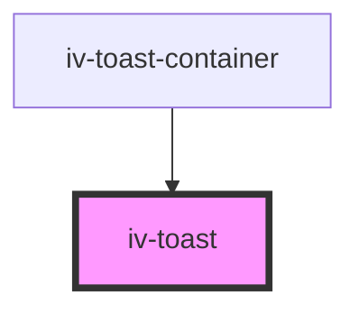

# iv-toast

<!-- Auto Generated Below -->

## Properties

| Property   | Attribute  | Description | Type                                          | Default     |
| ---------- | ---------- | ----------- | --------------------------------------------- | ----------- |
| `duration` | `duration` |             | `number`                                      | `3000`      |
| `message`  | `message`  |             | `string`                                      | `undefined` |
| `toastId`  | `toast-id` |             | `number`                                      | `undefined` |
| `type`     | `type`     |             | `"error" \| "info" \| "success" \| "warning"` | `'info'`    |

## Dependencies

### Used by

 - [iv-toast-container](../iv-toast-container)

### Graph

----------------------------------------------

*Built with [StencilJS](https://stenciljs.com/)*
