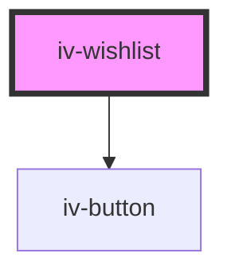

# iv-wishlist

<!-- Auto Generated Below -->

## Properties

| Property               | Attribute              | Description | Type                              | Default                      |
| ---------------------- | ---------------------- | ----------- | --------------------------------- | ---------------------------- |
| `buttonaddtocartvalue` | `buttonaddtocartvalue` |             | `string`                          | `'Add to cart'`              |
| `buttonaddvalue`       | `buttonaddvalue`       |             | `string`                          | `'Add to wishlist'`          |
| `buttonremovevalue`    | `buttonremovevalue`    |             | `string`                          | `'Remove from wishlist'`     |
| `previewtype`          | `previewtype`          |             | `"modal" \| "pullout"`            | `'modal'`                    |
| `productdata`          | `productdata`          |             | `string \| { [x: string]: any; }` | `{}`                         |
| `usefields`            | `usefields`            |             | `string`                          | `'id,title,price,image,url'` |
| `viewwishlistvalue`    | `viewwishlistvalue`    |             | `string`                          | `'View wishlist'`            |
| `wishlistempty`        | `wishlistempty`        |             | `string`                          | `'Your wishlist is empty'`   |

## Dependencies

### Depends on

- [iv-button](../iv-button)

### Graph

----------------------------------------------

*Built with [StencilJS](https://stenciljs.com/)*
